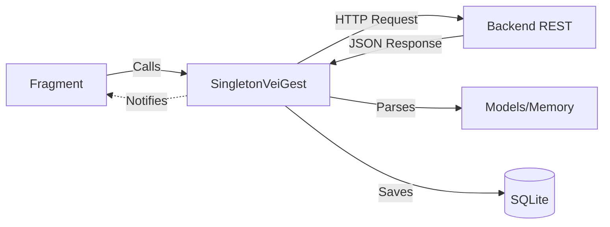

# 🏗️ Project Structure & Layer Architecture

The VeiGest Android project is divided into two main modules to ensure separation of concerns and reusability.

## 1. The Modules

### 📱 `app` (The Presentation Layer)
- **Role**: Handles UI, user interaction, and navigation.
- **Key Components**:
  - `Fragments`: Each screen in the app is usually a Fragment (e.g., `VehiclesFragment`).
  - `Adapters`: Manage how data is displayed in lists (e.g., `VehicleAdapter`).
  - `Activities`: `MainActivity` acts as the host for the Navigation Drawer and Fragment swapping.

### 📦 `veigest-sdk` (The Data & Logic Layer)
- **Role**: Handles data fetching, local caching, business logic, and API communication.
- **Key Components**:
  - `SingletonVeiGest`: The stateful hub connecting all components.
  - `Models`: Plain Java Objects (POJOs) representing the data (e.g., `Vehicle.java`).
  - `Database`: SQLite implementation for offline support.
  - `Utils`: JSON parsing and common helpers.

---

## 2. Communication Flow

The app follows a strict flow to keep the UI decoupled from the data complexity:

1. **Request**: UI (Fragment) calls a method in `SingletonVeiGest`.
2. **Action**: The SDK initiates an API request (via Volley) and/or updates the local Database.
3. **Internal Processing**: On success, the SDK parses the JSON and updates its internal memory list.
4. **Notification**: The SDK triggers an interface (Listener/Callback).
5. **Update**: The UI (which implements the Listener) refreshes itself with the new data.

## 3. Directory Layout (Root: `veigst/`)

### 📱 Presentation Layer (App)
- **Source Code**: [`app/src/main/java/com/ipleiria/veigest/`](file:///c:/xampp/htdocs/exame/veigst/app/src/main/java/com/ipleiria/veigest/)
- **XML Layouts**: [`app/src/main/res/layout/`](file:///c:/xampp/htdocs/exame/veigst/app/src/main/res/layout/)
- **UI Resources (Strings/Colors)**: [`app/src/main/res/values/`](file:///c:/xampp/htdocs/exame/veigst/app/src/main/res/values/)
- **App Menu**: [`app/src/main/res/menu/nav_drawer_menu.xml`](file:///c:/xampp/htdocs/exame/veigst/app/src/main/res/menu/nav_drawer_menu.xml)

### 📦 Logic Layer (SDK)
- **Core Singleton**: [`veigest-sdk/src/main/java/com/veigest/sdk/SingletonVeiGest.java`](file:///c:/xampp/htdocs/exame/veigst/veigest-sdk/src/main/java/com/veigest/sdk/SingletonVeiGest.java)
- **Models**: [`veigest-sdk/src/main/java/com/veigest/sdk/models/`](file:///c:/xampp/htdocs/exame/veigst/veigest-sdk/src/main/java/com/veigest/sdk/models/)
- **Database Helper**: [`veigest-sdk/src/main/java/com/veigest/sdk/database/VeiGestBDHelper.java`](file:///c:/xampp/htdocs/exame/veigst/veigest-sdk/src/main/java/com/veigest/sdk/database/VeiGestBDHelper.java)
- **JSON Parser**: [`veigest-sdk/src/main/java/com/veigest/sdk/utils/VeiGestJsonParser.java`](file:///c:/xampp/htdocs/exame/veigst/veigest-sdk/src/main/java/com/veigest/sdk/utils/VeiGestJsonParser.java)
- **Listeners**: [`veigest-sdk/src/main/java/com/veigest/sdk/listeners/`](file:///c:/xampp/htdocs/exame/veigst/veigest-sdk/src/main/java/com/veigest/sdk/listeners/)
